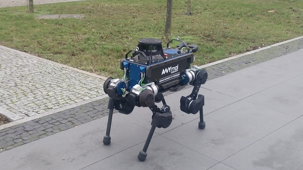
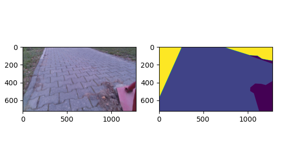
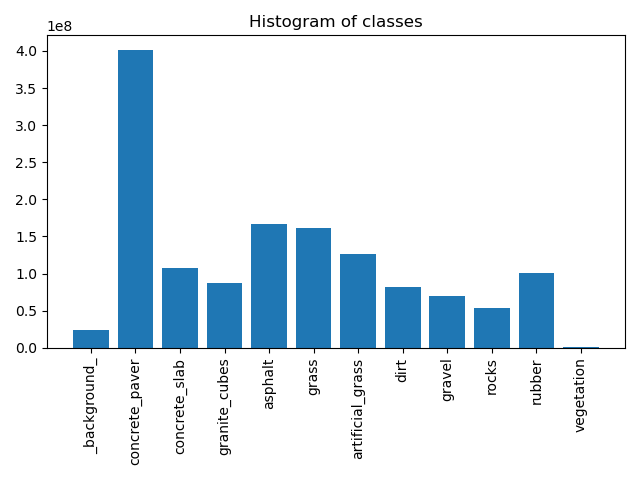

# PUT Campus Dataset

## Overview
This repository contains helper functions and TensorFlow dataloader for semantic segmentation [PUT Campus Dataset](https://drive.google.com/drive/folders/1LXzQQLrlDDFxgEAjbnid6p3FjRbGXpk6?usp=sharing).
Images were collected by [jbed94](https://github.com/jbed94) and me using [ANYmal B](https://rsl.ethz.ch/robots-media/anymal.html) robot in November 2019.
Dataset consists of 1498 RGB images (1280x720) annotated with 11 classes.   

 

## Samples
 

## Classes
 

